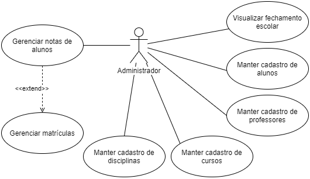
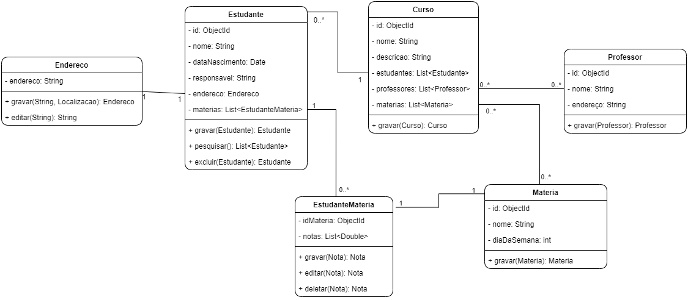

# School program

A simple program to manage students, teachers and others things.

### What was used to do?

  Java using Spring Boot framework, MongoDB, and Thymeleaf to create clean web templates.
  
## Useful links

* [Spring Boot Documentation](https://docs.spring.io/spring-boot/docs/current/reference/htmlsingle/) - The doc of framework
* [Spring with MongoDB](https://spring.io/guides/gs/accessing-data-mongodb/)
* [Thymeleaf](https://www.thymeleaf.org/) - Java template engine

## Diagrams
Use case diagram

Class diagram

## Run the application

 - Install Java 8
 - Download [MongoDB](https://www.mongodb.com/) and run in port 27017
 - Open the terminal in the root project folder and type `java -jar schoolproject.jar`
 - Open in your browser `http://localhost:8080/`
